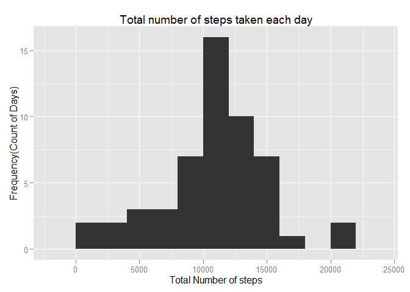
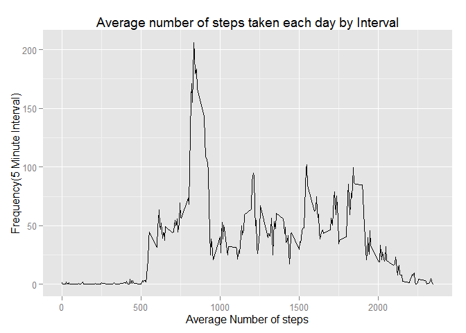
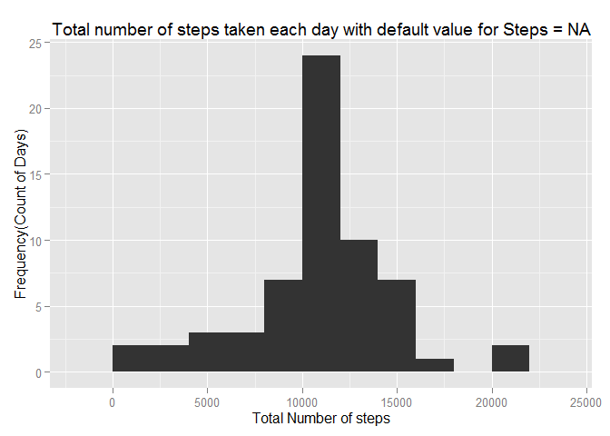
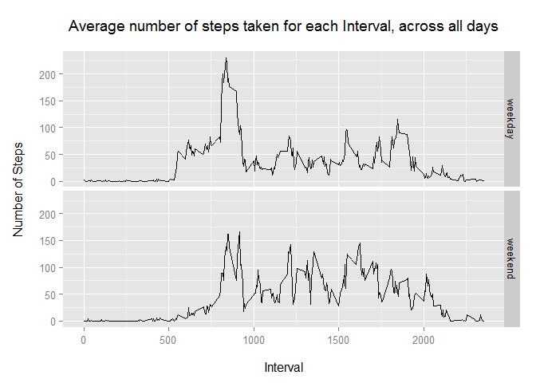

# Reproducible Research: Peer Assessment 1

Setting options for the overall file

```r
library(knitr)
opts_chunk$set(echo = TRUE, results = "asis")
```
## Loading the data

Load the data from CSV to variable activity

```r
activity = read.csv("activity.csv")
str(activity)
```

'data.frame':	17568 obs. of  3 variables:
 $ steps   : int  NA NA NA NA NA NA NA NA NA NA ...
 $ date    : Factor w/ 61 levels "2012-10-01","2012-10-02",..: 1 1 1 1 1 1 1 1 1 1 ...
 $ interval: int  0 5 10 15 20 25 30 35 40 45 ...

##Preprocessing the Data


```r
library(lubridate)
activity$date <- ymd(activity$date)
str(activity)
```

'data.frame':	17568 obs. of  3 variables:
 $ steps   : int  NA NA NA NA NA NA NA NA NA NA ...
 $ date    : POSIXct, format: "2012-10-01" "2012-10-01" ...
 $ interval: int  0 5 10 15 20 25 30 35 40 45 ...

```r
summary(activity)
```

     steps             date               interval     
 Min.   :  0.00   Min.   :2012-10-01   Min.   :   0.0  
 1st Qu.:  0.00   1st Qu.:2012-10-16   1st Qu.: 588.8  
 Median :  0.00   Median :2012-10-31   Median :1177.5  
 Mean   : 37.38   Mean   :2012-10-31   Mean   :1177.5  
 3rd Qu.: 12.00   3rd Qu.:2012-11-15   3rd Qu.:1766.2  
 Max.   :806.00   Max.   :2012-11-30   Max.   :2355.0  
 NA's   :2304                                          


## What is mean total number of steps taken per day?

```r
library(dplyr)
```

```
## 
## Attaching package: 'dplyr'
## 
## The following objects are masked from 'package:lubridate':
## 
##     intersect, setdiff, union
## 
## The following objects are masked from 'package:stats':
## 
##     filter, lag
## 
## The following objects are masked from 'package:base':
## 
##     intersect, setdiff, setequal, union
```

```r
steptakenbyday <- activity %>% 
                    na.omit() %>% 
                         group_by(date) %>% 
                              summarise(totalsteps = sum(steps)) 
```

Verifying filtered/aggregated data

```r
head(steptakenbyday, n=10)
```

Source: local data frame [10 x 2]

         date totalsteps
       (time)      (int)
1  2012-10-02        126
2  2012-10-03      11352
3  2012-10-04      12116
4  2012-10-05      13294
5  2012-10-06      15420
6  2012-10-07      11015
7  2012-10-09      12811
8  2012-10-10       9900
9  2012-10-11      10304
10 2012-10-12      17382

```r
str(steptakenbyday)
```

Classes 'tbl_df', 'tbl' and 'data.frame':	53 obs. of  2 variables:
 $ date      : POSIXct, format: "2012-10-02" "2012-10-03" ...
 $ totalsteps: int  126 11352 12116 13294 15420 11015 12811 9900 10304 17382 ...
 - attr(*, "na.action")=Class 'omit'  Named int [1:2304] 1 2 3 4 5 6 7 8 9 10 ...
  .. ..- attr(*, "names")= chr [1:2304] "1" "2" "3" "4" ...

## Make Historgram of total number of steps taken each day


```r
library(ggplot2)
qplot(totalsteps, data=steptakenbyday, geom="histogram", main = "Total number of steps taken each day", xlab = "Total Number of steps", ylab="Frequency(Count of Days)", binwidth=2000)
```

 

```r
stepsByDayCentralMeasures <- steptakenbyday %>% 
                    summarise(meanStepsByDay=as.numeric(mean(totalsteps)), 
                         medianStepsByDay=as.numeric(median(totalsteps)))

meanst <- mean(steptakenbyday$totalsteps)
medianst <- median(steptakenbyday$totalsteps)
```

The mean of the total number of steps taken per day is 1.0766189\times 10^{4}  
The median of the total number of steps taken per day is 10765

## What is the average daily activity pattern?

```r
avgdailyactivity <- activity %>% 
                         na.omit() %>% 
                              group_by(interval) %>% 
                                   summarise(avgsteps = mean(steps))

head(avgdailyactivity, 10)
```

Source: local data frame [10 x 2]

   interval  avgsteps
      (int)     (dbl)
1         0 1.7169811
2         5 0.3396226
3        10 0.1320755
4        15 0.1509434
5        20 0.0754717
6        25 2.0943396
7        30 0.5283019
8        35 0.8679245
9        40 0.0000000
10       45 1.4716981

Time Series Plot 


```r
qplot(x=interval, y=avgsteps, data=avgdailyactivity, geom="line", main = "Average number of steps taken each day by Interval", xlab = "Average Number of steps", ylab="Frequency(5 Minute Interval)")
```

 


```r
which.max(avgdailyactivity$avgsteps)
```

[1] 104

```r
maxindex <- which.max(avgdailyactivity$avgsteps)
intervalav <- avgdailyactivity[maxindex,1]
avsteps <- avgdailyactivity[maxindex,2]
```
Max steps 5 minute interval is 206.1698113 for interval 835


## Imputing missing values

Identify missing values

```r
summiss<- sum(is.na(activity$steps))
```
Count of missing values in Dataset is 2304

Startegy for filling missing value in dataset

```r
nadataset <- activity[which(is.na(activity$steps)),]
nadataset <- nadataset %>%
               inner_join(avgdailyactivity, by="interval") %>%
                    mutate(steps=avgsteps) %>%
                         select(-avgsteps)
head(nadataset)
```

      steps       date interval
1 1.7169811 2012-10-01        0
2 0.3396226 2012-10-01        5
3 0.1320755 2012-10-01       10
4 0.1509434 2012-10-01       15
5 0.0754717 2012-10-01       20
6 2.0943396 2012-10-01       25

Combined new dataset with default missing value

```r
combineddataset  <- activity

combineddataset[which(is.na(combineddataset$steps)), 1] <- nadataset[ , 1]

head(combineddataset)
```

      steps       date interval
1 1.7169811 2012-10-01        0
2 0.3396226 2012-10-01        5
3 0.1320755 2012-10-01       10
4 0.1509434 2012-10-01       15
5 0.0754717 2012-10-01       20
6 2.0943396 2012-10-01       25

```r
sum(!complete.cases(combineddataset))
```

[1] 0

```r
newStepsByDay <- combineddataset %>% 
                     group_by(date) %>% 
                         summarise(totalSteps=sum(steps))

head(newStepsByDay)
```

Source: local data frame [6 x 2]

        date totalSteps
      (time)      (dbl)
1 2012-10-01   10766.19
2 2012-10-02     126.00
3 2012-10-03   11352.00
4 2012-10-04   12116.00
5 2012-10-05   13294.00
6 2012-10-06   15420.00
histogram on new dataset

```r
qplot(totalSteps, data = newStepsByDay, geom = "histogram", main = "Total number of steps taken each day with default value for Steps = NA", xlab = "Total Number of steps", ylab="Frequency(Count of Days)", binwidth=2000)
```

 

```r
tapply(nadataset$steps, as.factor(nadataset$date), sum)
```

2012-10-01 2012-10-08 2012-11-01 2012-11-04 2012-11-09 2012-11-10 
  10766.19   10766.19   10766.19   10766.19   10766.19   10766.19 
2012-11-14 2012-11-30 
  10766.19   10766.19 

```r
newStepsByDayCentralMeasures <- newStepsByDay %>% 
               summarise(meanStepsByDay=as.numeric(mean(totalSteps)), 
               medianStepsByDay=as.numeric(median(totalSteps)))
rbind(stepsByDayCentralMeasures, newStepsByDayCentralMeasures)
```

Source: local data frame [2 x 2]

  meanStepsByDay medianStepsByDay
           (dbl)            (dbl)
1       10766.19         10765.00
2       10766.19         10766.19


## Are there differences in activity patterns between weekdays and weekends?


```r
combineddataset <- combineddataset %>% 
               mutate(weekdays=ifelse(weekdays(date) == "Saturday" | 
                                      weekdays(date) == "Sunday", 
                                      "weekend", 
                                      "weekday"))
combineddataset$weekdays <- as.factor(combineddataset$weekdays)
str(combineddataset)
```

'data.frame':	17568 obs. of  4 variables:
 $ steps   : num  1.717 0.3396 0.1321 0.1509 0.0755 ...
 $ date    : POSIXct, format: "2012-10-01" "2012-10-01" ...
 $ interval: int  0 5 10 15 20 25 30 35 40 45 ...
 $ weekdays: Factor w/ 2 levels "weekday","weekend": 1 1 1 1 1 1 1 1 1 1 ...

```r
revisedStepsByInterval <- combineddataset %>%
                          group_by(interval, weekdays) %>%
                              summarise(averageSteps=mean(steps))
head(revisedStepsByInterval, n=10)
```

Source: local data frame [10 x 3]
Groups: interval [5]

   interval weekdays averageSteps
      (int)   (fctr)        (dbl)
1         0  weekday  2.251153040
2         0  weekend  0.214622642
3         5  weekday  0.445283019
4         5  weekend  0.042452830
5        10  weekday  0.173165618
6        10  weekend  0.016509434
7        15  weekday  0.197903564
8        15  weekend  0.018867925
9        20  weekday  0.098951782
10       20  weekend  0.009433962

```r
qplot(x=interval,
      y=averageSteps,
      data=revisedStepsByInterval,
      geom="line",
      main="Average number of steps taken for each Interval, across all days\n",
      xlab="\nInterval",
      ylab="Number of Steps\n",
      facets=weekdays ~ .)
```

 

Pattern does not differ much between weekday and weekend
